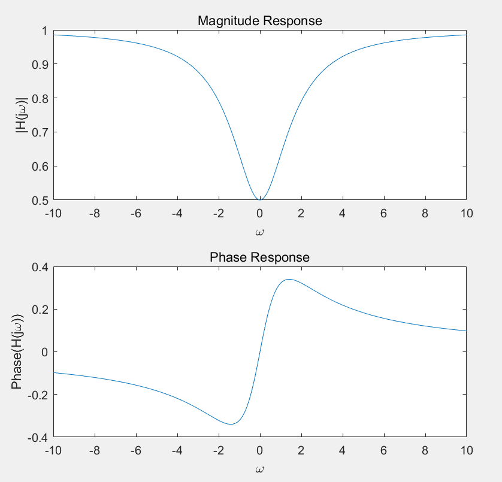
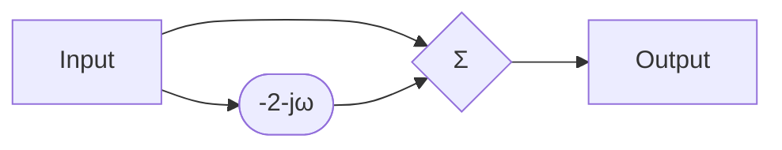
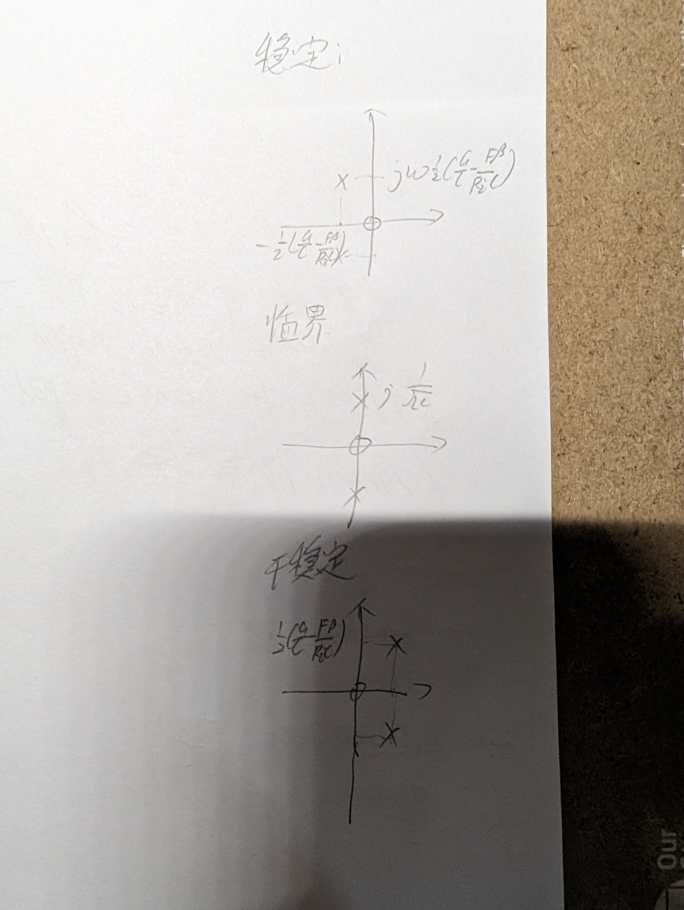

# week11

## 4-11 

初始状态：
$$
u_C=E\frac{R}{R+R}=\frac12E\\
i_C=0
$$

切换后：
$$
u_C(0_+)=u_C(0_-)=\frac12E\\
i(0) = i_C(0_+)=i_C(0_-)=0\\
sLi(t)+\frac1{sC}i(t)+\frac{U_C(0_-)}s=0\\
\to i(t)=\frac E{2L}\frac1{s^2+\frac1{LC}}\\
\to i(t)=\frac E{2L}\sqrt{LC}\cdot\sin(\frac t{\sqrt{LC}})u(t)
$$

## 补充题

$$
e(t)\to \frac{5s}{s^2+1}\\
r_{zs}(t)\to \frac2{s+2}+\frac{3s-1}{s^2+1}\\
\therefore H(s)=\frac{R(s)}{E(s)}=\frac{s+1}{s+2}=1-\frac{1}{s+2}\\
h(t)=\delta(t)-e^{-2t}\\
$$

$$
H(j\omega)=(1-\frac1{j\omega+2})
$$

## 4-50

$$
\mathcal L(f(t))=\int^{+\infty}_{-\infty}f(t)e^{-st}dt=\\
\begin{array}l
\int^{+\infty}_0e^{-(s+a)t}dt\to\frac1{s+a}\\
+\int_{-\infty}^0e^{-(s-a)t}dt\to-\frac1{s-a}&(a>0)\\
\end{array}\\
=\frac{-2a}{(s-a)(s+a)}\\
\therefore 收敛于(-a,a)
$$

## 4-47

$$
V_1(s)+FV_2(s)=\frac{V_2(s)}K\\
\to 1+FH(s)=\frac{H(s)}K\\
H(s)=\frac1{\frac1K-F}=\frac{\beta Z(s)}{R_i-F\beta Z(s)}=\frac{\frac\beta{R_iC}s}{s^2+(\frac GC-\frac{F\beta}{R_iC})s+\frac1{LC}}\\
\therefore 所求条件为\frac GC=\frac{F\beta}{R_iC}
$$

